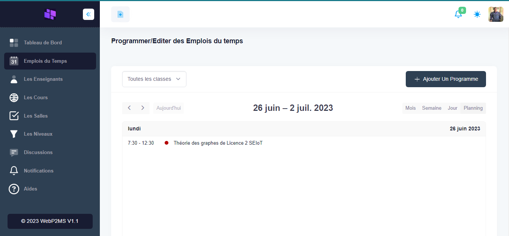

# WebP2MS

WebP2MS (Web Platform for Managing and Monitoring Schedules) est une application web de gestion des emplois.

## Fonctionnalités

- Gestion des enseignements et de la masse horaire [fait par les Coordonnateurs de formation]
- Planification des emplois de temps [fait par les Coordonnateurs de formation]
- Consultation des emplois du temps publiés [par les étudiants]
- Capacité de chater sur un emploi du temps entre les enseignants et l'administration
- Capacité d'installer notre application sur smartphone et sur PC en tant que application PWA


## Installation

Pour cloner et travailler sur ce référentiel, suivez les étapes ci-dessous :

1. Assurez-vous d'avoir Git installé sur votre système. Si ce n'est pas le cas, vous pouvez le télécharger et l'installer à partir du site officiel de Git : https://git-scm.com/downloads.

2. Ouvrez votre terminal ou votre interface de ligne de commande.

3. Accédez au répertoire dans lequel vous souhaitez cloner le projet en utilisant la commande `cd` :

```bash
cd chemin/vers/le/répertoire
```

4. Clonez le référentiel en utilisant la commande `git clone` :

```bash
git clone https://github.com/BlakvGhost/PIL1_2223_34.git
```

5. Accédez au répertoire du projet nouvellement cloné :
```bash
cd PIL1_2223_34
```

6. Installer Django et les dépendances du projet:
```bash
pip install -r requirements.py
```

7. Demarrer le serveur d'application django:
```bash
py manage.py runserver
```

8. Dirigez vous dans le dossier `template` et travailler sur le fichier qui vous concerne

9. N'importez rien d'externe comme fichiers `images, polices ou bootstrap`, tout est deja inclus, commencez juste à ecrire votre code et utiliser le fichier `static/css/master.css` pour ecrire votre css

10. Connectez vous avec un compte admin pour une vue générale
    - email: `exemple@exemple.com`
    - password: `passme`
11. Pour un compte d'enseignant, utilisez:
    - email: `aliyouousmane@exemple.com`
    - password: `passme`

Maintenant, vous pouvez commencer à travailler sur le projet localement et utiliser les commandes Git pour effectuer des commits, etc.

## Commandes Git de base

Voici quelques commandes Git de base pour vous aider à commencer :

- `git status` : Affiche l'état actuel du référentiel et des fichiers modifiés.

- `git add <nom-du-fichier>` : Ajoute un fichier spécifique à l'index pour préparer le commit.

- `git add .` : Ajoute tous les fichiers modifiés à l'index pour préparer le commit.

- `git commit -m "message-du-commit"` : Effectue un commit avec un message donné.

- `git push` : Pousse les commits locaux vers le référentiel distant.

- `git pull` : Récupère les dernières modifications du référentiel distant vers votre copie locale.

- `git branch` : Affiche toutes les branches disponibles dans le référentiel.

- `git checkout <nom-de-la-branche>` : Bascule vers une branche spécifique.

- `git merge <nom-de-la-branche>` : Fusionne une branche spécifique avec la branche actuelle.

- `git log` : Affiche l'historique des commits.

Ces commandes de base devraient vous permettre de démarrer avec Git. Pour en savoir plus sur Git et ses fonctionnalités, vous pouvez consulter la documentation officielle de Git : https://git-scm.com/doc.

N'hésitez pas à explorer davantage et à utiliser des fonctionnalités plus avancées de Git selon vos besoins.

`Note` : Assurez-vous de toujours bien comprendre les effets de chaque commande Git que vous utilisez afin de ne pas perdre de travail ou apporter des modifications indésirables au référentiel.

# Avertissement

`IMPORTANT` : Avant de faire des commits, veuillez prendre en compte les points suivants :

1. Assurez-vous d'être sur votre propre branche de travail. Ne faites pas de commits directement sur la branche principale `main`.

2. Avant de commencer à travailler sur une nouvelle fonctionnalité ou à effectuer des modifications, créez une nouvelle branche à partir de la branche principale en utilisant la commande `git checkout -b <nom-de-votre-branche>`.

3. Effectuez vos modifications et ajoutez vos fichiers modifiés à l'index en utilisant la commande `git add <nom-du-fichier>` ou `git add .` pour ajouter tous les fichiers modifiés.

4. Faites des commits réguliers avec des messages descriptifs en utilisant la commande `git commit -m "message-du-commit"`. Cela vous permettra de garder une trace claire de vos modifications.

5. Avant de pousser vos commits vers le référentiel distant, assurez-vous de récupérer les dernières modifications de la branche principale en utilisant la commande `git pull`. Cela permettra de résoudre les éventuels conflits avant de pousser vos modifications.

6. Enfin, poussez vos commits vers le référentiel distant en utilisant la commande `git push origin <nom-de-votre-branche>`.

7. Une fois que vous avez terminé une fonctionnalité ou une tâche, vous pouvez créer une demande de fusion (pull request) pour intégrer vos modifications à la branche principale.

Cet avertissement est destiné à garantir un bon flux de travail et à éviter les conflits ou les pertes de travail. Veuillez suivre ces bonnes pratiques lors de l'utilisation de Git.

Si vous avez des questions ou des doutes, n'hésitez pas à demander en cliquant ici [par whatsapp](https://wa.me/22995181019) ou 
[par mail](mailto:kabirou2001@gmail.com)


## Tech Stack

**Client:** HTML5, CSS3, Bootstrap 5, Vue.js3

**Server:** Django

## Authors

- [@Groupe34](https://github.com/BlakvGhost/PIL1_2223_34)


## License

Ce projet est distribué sous la licence
[MIT](https://choosealicense.com/licenses/mit/).

## Restriction d'accès

Ce projet est destiné à être éditer et consulter uniquement par les membres du groupe de travail avec lesquels il est élaboré.

## Capture d'écran


